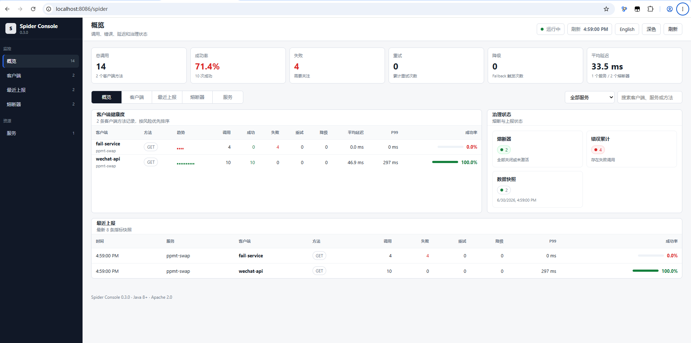

# 浩轩的下午：一个 Spider 的故事

> 浩轩是一名 Java 后端开发。这个周三下午改变了他对 HTTP 调用的认知。
>
> 他后来把这一天记在备忘录里："2026.6.30，我写完了对接用户服务的代码——六分钟。然后我不知道剩下的 5 小时 54 分钟该干什么。"

---

## 一、任务

PM 在钉钉上发了三个字：「用户服务。」

浩轩知道这意味着什么。对接用户服务的 API——获取用户信息、创建用户、更新头像。标准的 CRUD。如果按老方法，他需要：

1. 引入 OkHttp 依赖
2. 配置连接池（连接超时多长？读超时多长？最大空闲连接？保活多久？——他每次都要翻 OkHttp 文档，因为记不住）
3. 写一个 HttpClient 工具类，封装 GET / POST / PUT / DELETE
4. 每次调用手动拼接 URL，加上 query 参数，设置 header
5. 拿到 Response 后判断状态码：200 要解析，404 要打日志，500 要不要重试？
6. 重试逻辑自己写——重试几次？退避多久？指数还是固定？POST 要不要重试？被限流了怎么办？
7. 每个接口都要写 `try { ... } catch (IOException e) { ... }`，写着写着发现异常类型越来越多，最后 `catch (Exception e)` 一锅端
8. 老板问"调用成功率多少"——沉默，因为根本没埋点
9. 有一天用户服务挂了——所有调用方线程池打满，没人知道为什么
10. 老板说"加个监控"——浩轩打开 Grafana 文档，关掉，打开了 B 站

他叹了口气。他今天不想写第 47 个 try-catch。

他决定试试 Spider。

## 二、上手

浩轩在 pom.xml 里加了一行：

```xml
<dependency>
    <groupId>io.github.hdkjcom.spider</groupId>
    <artifactId>spider-spring-boot-starter</artifactId>
    <version>1.0.0</version>
</dependency>
```

没有第二个依赖。没有 "spider-http"、"spider-jackson"、"spider-metrics"——一个就够了。

他写了一个接口：

```java
@SpiderClient(name = "user-service", url = "http://localhost:8081")
public interface UserClient {

    @SpiderGet("/users/{id}")
    UserDTO getUser(@Path("id") Long id);

    @SpiderPost("/users")
    UserDTO createUser(@Body CreateUserRequest req);
}
```

在启动类上加了 `@EnableSpiderClients`，在 Controller 里 `@Autowired` 了一下。

跑了。

浩轩看了眼手表。**六分钟。** 他还没泡茶。

"就这？"

他检查了一下：请求发出去了，返回了 JSON，自动反序列化成了 UserDTO——什么都没配。OkHttp 在哪？Jackson 在哪？连接池在哪？全在 starter 里，他什么都没看见。

他决定再加点东西。

## 三、加防御

浩轩想起来了：用户服务是一个已经跑了三年的老项目，偶尔会在午饭高峰时段返回 503。以前他们的做法是……算了，不提以前了。

他加了一行：

```java
@SpiderGet("/users/{id}")
@Retry(maxAttempts = 3, backoffStrategy = EXPONENTIAL, jitter = true)
UserDTO getUser(@Path("id") Long id);
```

Spider会自动识别这是个 GET 请求（幂等），默认可重试。POST/PUT 则默认不重试——除非你明确配上 `@Retry`。

然后他想：万一用户服务彻底挂了，重试也没用，别让它把调用方线程池也拖死。加个熔断：

```java
@SpiderClient(name = "user-service",
              url = "http://localhost:8081",
              fallback = UserFallback.class)
@SpiderCircuitBreaker(failureRateThreshold = 50)
public interface UserClient { ... }
```

再写个三行的 fallback：

```java
public class UserFallback implements UserClient {
    @Override
    public UserDTO getUser(Long id) {
        return UserDTO.empty(id);  // 返回默认头像、未知用户名
    }
}
```

"够了。"浩轩想，"再配就有点装了。"

然后他鬼使神差地打开了浏览器，输入 `http://localhost:8086/spider`。

## 四、Dashboard

浩轩愣了三秒。

一个完整的 Dashboard 出现在他面前：



| 服务概览 | 客户端指标 | 熔断器状态 |
|---|---|---|
| 调用 12 次 | wechat-api: 调用 5 次，成功率 100% | wechat-api: CLOSED |
| 成功率 100% | user-service: 调用 7 次，成功率 100% | user-service: CLOSED |
| p50 24ms | 方法级拆分：GET /users/{id}、POST /users | fail-service: CLOSED |

下面还有一排迷你趋势图——绿色竖条代表成功，红色代表失败，最近 30 次调用的历史一目了然。

他往下翻。治理状态卡片展示了熔断器数量、失败数、数据快照数。他还看到了一个「最近上报」模块，显示最新 8 条指标快照。

右上角有个🌙按钮。他点了一下——暗色模式。

"这……我没部署任何东西啊。"浩轩看了看自己只写了 20 行代码的接口。Dashboard 是 starter 带的，数据是从内存直接读的——没有额外的控制台服务，没有 Elasticsearch，没有 Prometheus 配置。

他喝了一口茶。茶还没凉。

## 五、演进

一周后，架构组宣布全面接入 Nacos 服务发现。用户服务的地址不再是固定 IP，而是从注册中心动态获取。

浩轩把 `url` 删了：

```java
@SpiderClient(name = "user-service")  // url 留空，走服务发现
public interface UserClient { ... }
```

他没配 `spider.nacos.server-addr`——因为 Spring Cloud Nacos 已经配了 `spring.cloud.nacos.discovery.server-addr`，Spider 自动复用了它。浩轩看到这条逻辑的时候点了点头，但没说话。

又过了两周。下午三点，用户服务突然响应变慢，告警群里开始刷消息。

浩轩打开 Apollo 配置中心，找到这个键：

```
spider.client.user-service.timeout = 5000
```

原本是 2000。他改成 5000，点击发布。**没重启。** 再打开另一个键：

```
spider.client.user-service.retry.backoff = 200
```

原本是 100。改成 200。还是没重启。

三分钟后，用户服务自己恢复了（运维在处理数据库连接池）。浩轩把配置改回了原来的值。从头到尾，他的服务没有重启过一次。

他想起以前每次改超时都要重新打包、发版、等审批、灰度发布的流程。他喝了一口茶。这次茶真的凉了。

## 六、一个月后

浩轩的项目已经接入了四个微服务：用户服务、支付服务、订单服务、微信 API。每个都有不同的超时、重试策略、熔断阈值。配置文件整整齐齐：

```yaml
spider:
  default-timeout: 5000
  clients:
    pay-service:
      timeout: 3000
      retry:
        max-attempts: 2
    wechat-api:
      timeout: 10000
      retry:
        max-attempts: 1
```

PM 又来了：「浩轩，那个付款接口的 OpenAPI spec 有了，你能不能……」

「能。」浩轩打断了她。

他打开终端：

```java
SpiderCodegen codegen = new SpiderCodegen();
codegen.generate(new File("pay-api.json"));
```

一个完整的 `@SpiderClient` 接口生成了，带 DTO、带注解、带使用说明注释。浩轩把它扔到项目里，给支付接口也加上了重试和超时。

下班前，同事路过他的工位，看到 Dashboard 上的趋势图，问了一句：「这是什么监控平台？」

「Spider。」浩轩说。

同事点点头：「名字挺帅的。」

浩轩想说点什么——关于过滤器链、SPI 扩展点、类型化异常体系、动态配置覆盖——但他换了个说法：

> **「一个依赖，一个注解。六分钟。」**

---

人生没有 Ctrl+Z，但永远可以 `git checkout` 到一个新的分支。真正重要的，不是你曾经在哪个分支提交过多少代码，而是最后，你把自己 `merge` 到了一个真正想成为的人生里。

---

*浩轩的故事到这里就结束了。你的故事可以[从这里开始](quickstart.md)。*
